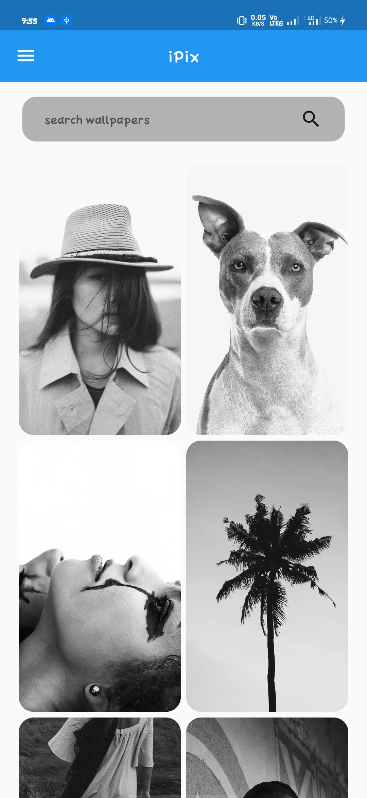
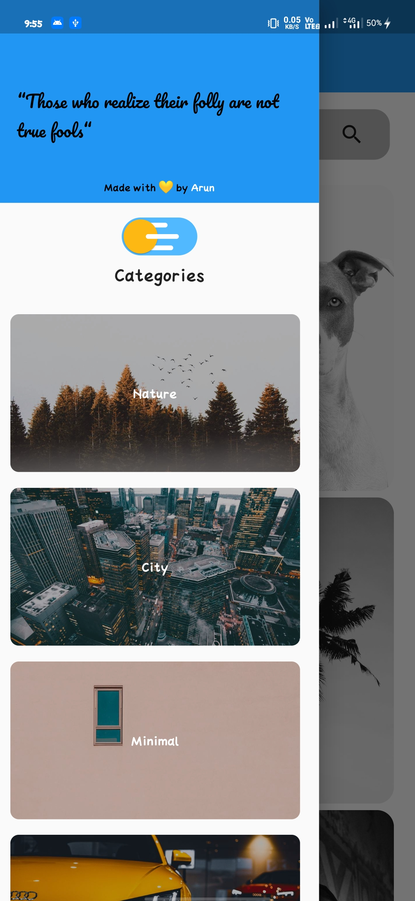
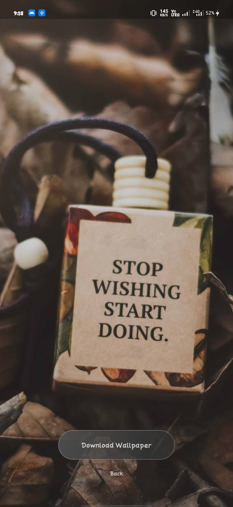
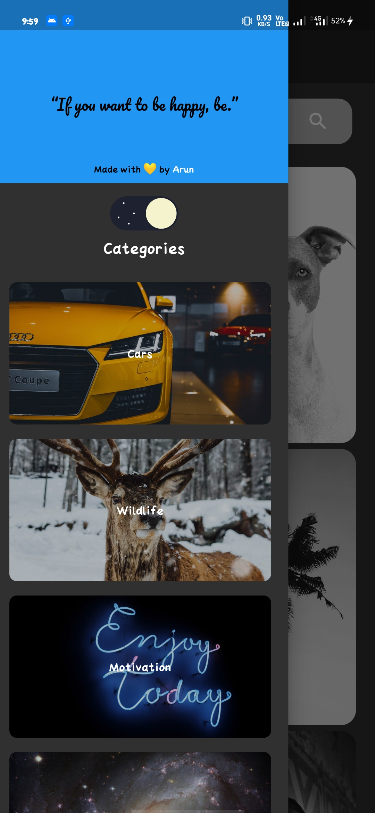
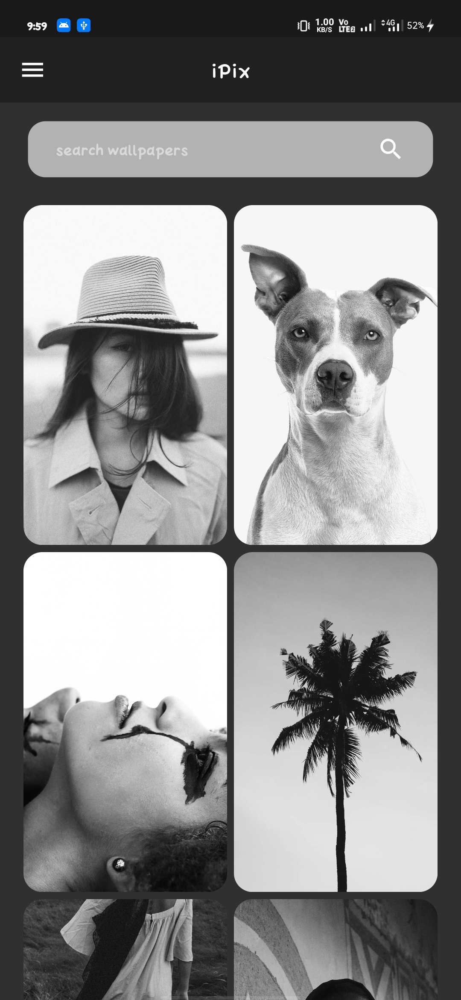

# iPix-flutterapp

Wallpaper app by Flutter

# Installation

1. Clone this repo

2. Go to Home directory
  ```bash
  cd iPix
  ```
  
3. Add [pexels](https://www.pexels.com/api/?locale=en-US) APIKEY to  /lib/data/data.dart

4. Connect your device or emulator

5. Run this command
  ```bash
  flutter run --verbose
  ```
  

# Previews


                


                


## New to Flutter ?

This project is a starting point for a Flutter application.

A few resources to get you started if this is your first Flutter project:

- [Lab: Write your first Flutter app](https://flutter.dev/docs/get-started/codelab)
- [Cookbook: Useful Flutter samples](https://flutter.dev/docs/cookbook)

For help getting started with Flutter, view our
[online documentation](https://flutter.dev/docs), which offers tutorials,
samples, guidance on mobile development, and a full API reference.


## Contributing
Pull requests are welcome. For major changes, please open an issue first to discuss what you would like to change.

Give ⭐ if you love this work ❤️


